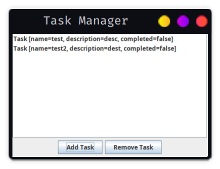

# Простое приложение для управления задачами

Это простое приложение на Java Swing для управления списком задач.
Пользователь может добавлять и удалять задачи.

## Установка 
1. Убедитесь, что у вас установлена JDK.
2. Склонируйте репозиторий: 
```shell
git clone https://github.com/Hardwired8403/TaskManagerApp.git
 ```

## Запуск

1. Перейдите в каталог с проектом: 
```shell 
cd task-manager-app
```
2. Соберите проект и запустите приложение с помощью Maven
```shell
mvn clean compile exec:java
```

## Использование

- Добавление задачи: Нажмите кнопку "Add Task" и введите название и описание задачи.
- Удаление задачи: Выберите задачу из списка и нажмите кнопку "Remove Task".

## Скриншоты



## Зависимости

- Java Swing
- Maven

## Автор

[Ваше имя или никнейм]

## Лицензия

Этот проект лицензируется в соответствии с лицензией [MIT License](LICENSE).
